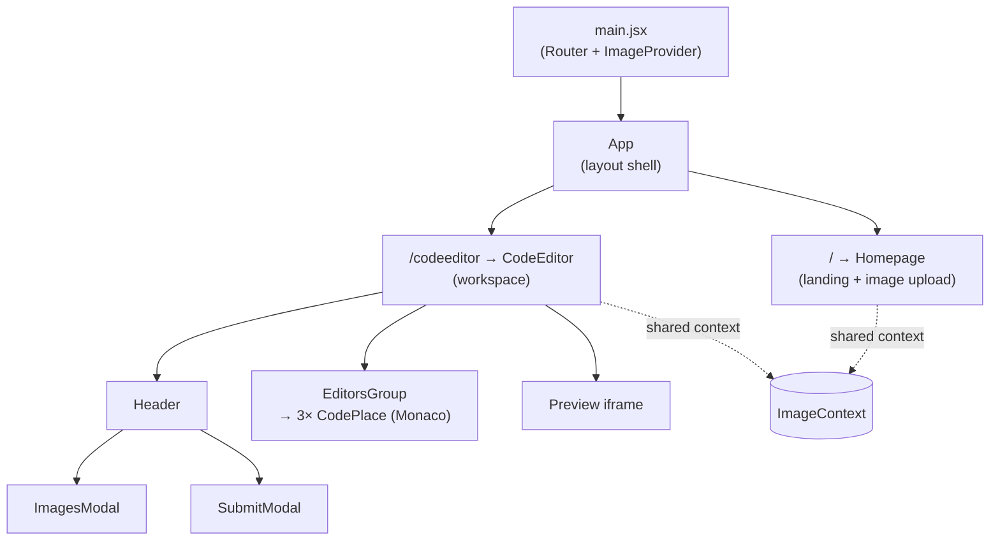
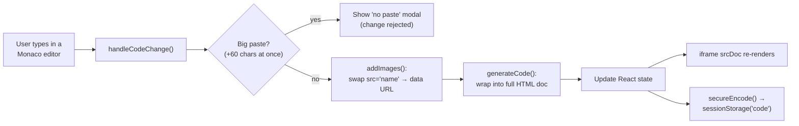
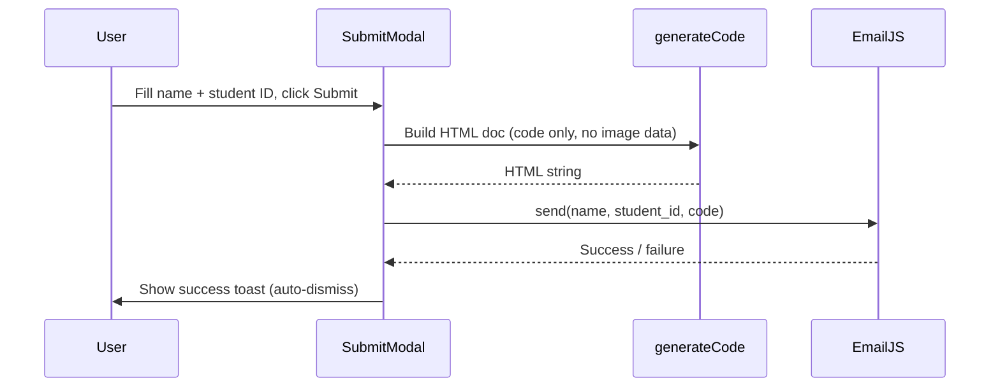
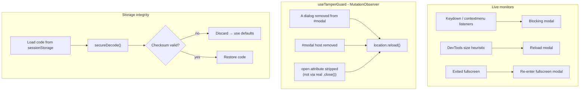

# NoCheating — Live Code Editor

A React, in-browser **HTML/CSS/JS playground** with instant live preview, built for **fair online assessments and coding competitions**. It uses the Monaco Editor (the engine behind VS Code) for a rich editing experience, Tailwind CSS for a responsive UI, and ships with layered **anti-cheat and tamper-protection** measures. Students can upload images, preview their work in real time, and submit it to an instructor by email — all with zero install.

**Live demo:** https://hs-live-editor.vercel.app

---

## Features

### Editing & Preview
- **Three Monaco editors** (HTML, CSS, JavaScript) with syntax highlighting, autocomplete, and the VS Code feel.
- **Accordion layout** — expand any one editor to focus on it; the others collapse to a header bar with a smooth, boundary-anchored animation.
- **Real-time preview** rendered into a sandboxed `<iframe>` as you type.
- **Animated fullscreen preview** — a GPU-composited FLIP animation grows the preview to cover the whole viewport (with a frosted "loading" veil during the transition so text never shimmers).

### Mobile-friendly
- Fully responsive from phone to desktop.
- On phones, the editor and preview don't fight for space: a floating **eye button** swaps between **Code** and **Preview** with a card-stack animation (both panels stay mounted, so editor state is preserved).

### Images
- Upload images and reference them in HTML by the **name you choose** (``).
- The editor swaps those names for the real image data **in the live preview** so you see them as you work.
- Note: image data is **not** included in the email submission (see Limitations) — the emailed code keeps the original `src="name"` references.

### Submission
- Submit code to an instructor via **EmailJS** — name, student ID, and the generated HTML/CSS/JS.

### Anti-cheat & integrity
- Blocks **copy / paste / cut** (Ctrl/Cmd + C/V/X) and the **right-click** context menu (in the page, the editors, and the preview iframe).
- Intercepts **DevTools** shortcuts (F12, Ctrl+Shift+I/J/C, etc.) and detects a DevTools window heuristically.
- Requires **fullscreen** to keep coding.
- Flags **paste of large chunks** of code.
- **Tamper guard** — if a blocking modal is deleted or hidden via DevTools, the page reloads automatically.
- **Obfuscated storage** — code saved to `sessionStorage` is encoded with an integrity checksum; edited/forged storage is rejected on load.

> **Security note:** all protections run client-side and are *deterrents*, not guarantees. A determined user with the debugger can bypass them; true integrity requires server-side validation.

---

## Tech Stack
- **React 19** + **React Router 7**
- **@monaco-editor/react** (Monaco Editor)
- **Tailwind CSS 4** (via `@tailwindcss/vite`)
- **EmailJS** (`@emailjs/browser`) for submissions
- **lucide-react** + Font Awesome for icons
- **Vite 7** build tooling, deployed as a static site on **Vercel**

---

## Architecture

### Routes & component overview



### From keystroke to live preview



`generateCode()` wraps the three sources into one document — `<style>` for CSS, a deferred `<script>` (with smooth-scroll handling for in-page anchors and a `try/catch` around user JS), and the HTML in `<body>`.

### Submission flow



### Anti-cheat & tamper guard



---

## Quick Start

**Requirements:** Node.js (LTS)

```bash
npm install      # install dependencies
npm run dev      # start Vite dev server
npm run build    # production build
npm run preview  # preview the production build
npm run lint     # run ESLint
```

### Environment variables
Submission uses EmailJS. Create a `.env.local` with:

```bash
VITE_EMAILJS_SERVICE_ID=your_service_id
VITE_EMAILJS_TEMPLATE_ID=your_template_id
VITE_EMAILJS_PUBLIC_KEY=your_public_key
```

The EmailJS template should accept `{{name}}`, `{{student_id}}`, and `{{code}}`.

---

## Limitations
- **Client-side only.** All anti-cheat/integrity measures are deterrents; pair with server-side checks for real assessments.
- **No images in submissions.** EmailJS caps total variable size at ~50 KB, and base64 image data far exceeds that. So image data is intentionally excluded from the email — only the code (HTML/CSS/JS) is sent, with `src="name"` references left as-is. Images still appear in the live preview. (To deliver images, host them externally and email the URLs, or use a backend.)
- **Modern browser required** for `<dialog>`, the Fullscreen API, `MutationObserver`, and Monaco.
